# Forward Kinematics 

This repository is used to document **Denavit–Hartenberg (DH) frame placement** and **homogeneous transformation matrices** for diferent robots.

---

#  Robot 1

## Robot Photo

## Frame Assignment / Scheme
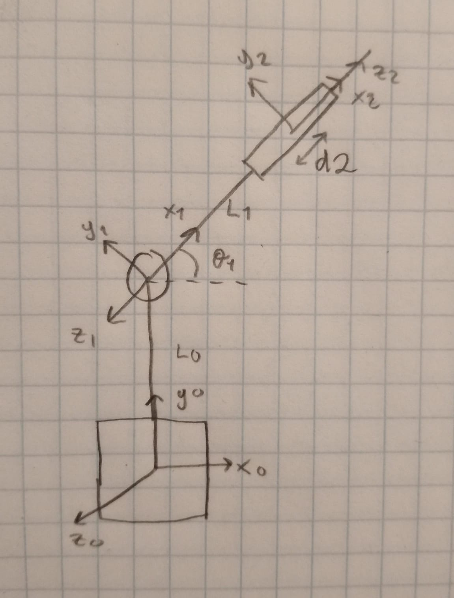

## DH Table and matrixes 

---

#  Robot 2

## Robot Photo
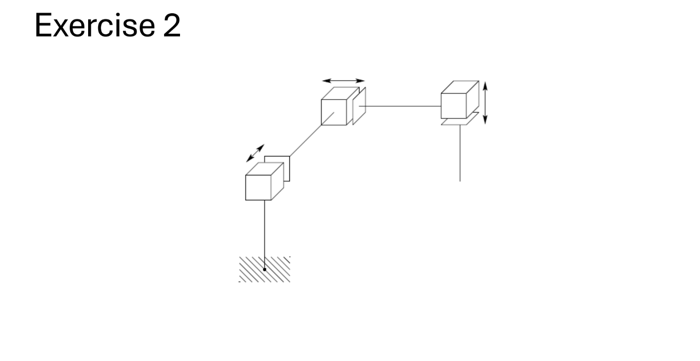

## Frame Assignment / Scheme
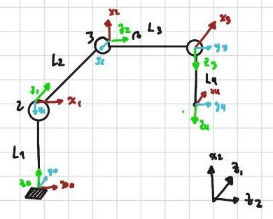

## DH Table 

---

#  Robot 3

## Robot Photo

## Frame Assignment / Scheme
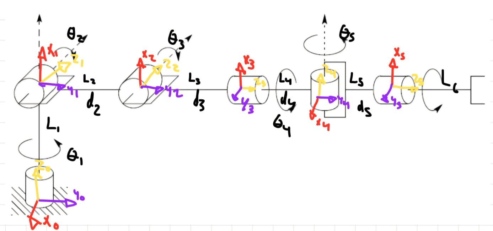

## DH Table 
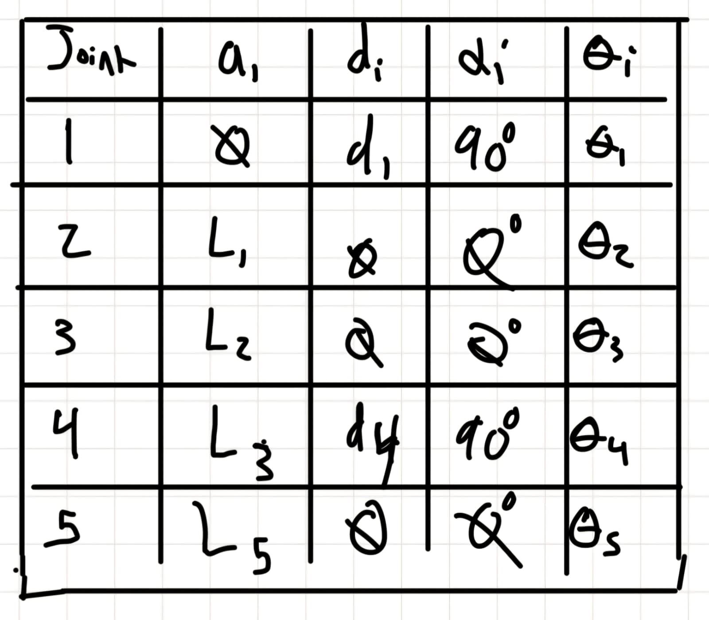

---

#  Robot 4

## Robot Photo

## Frame Assignment / Scheme
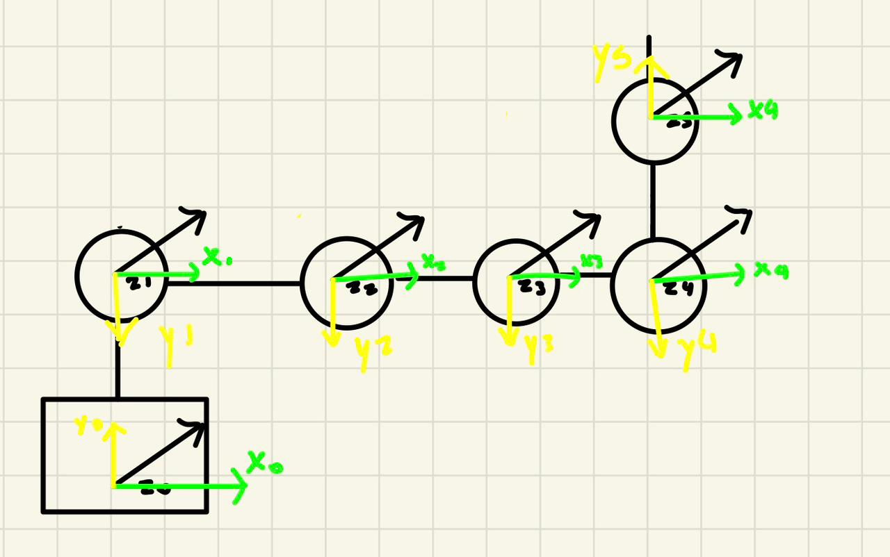

## DH Table 
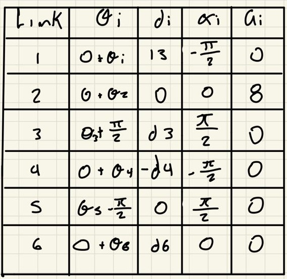
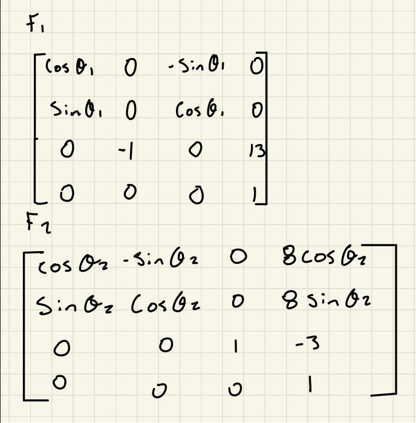
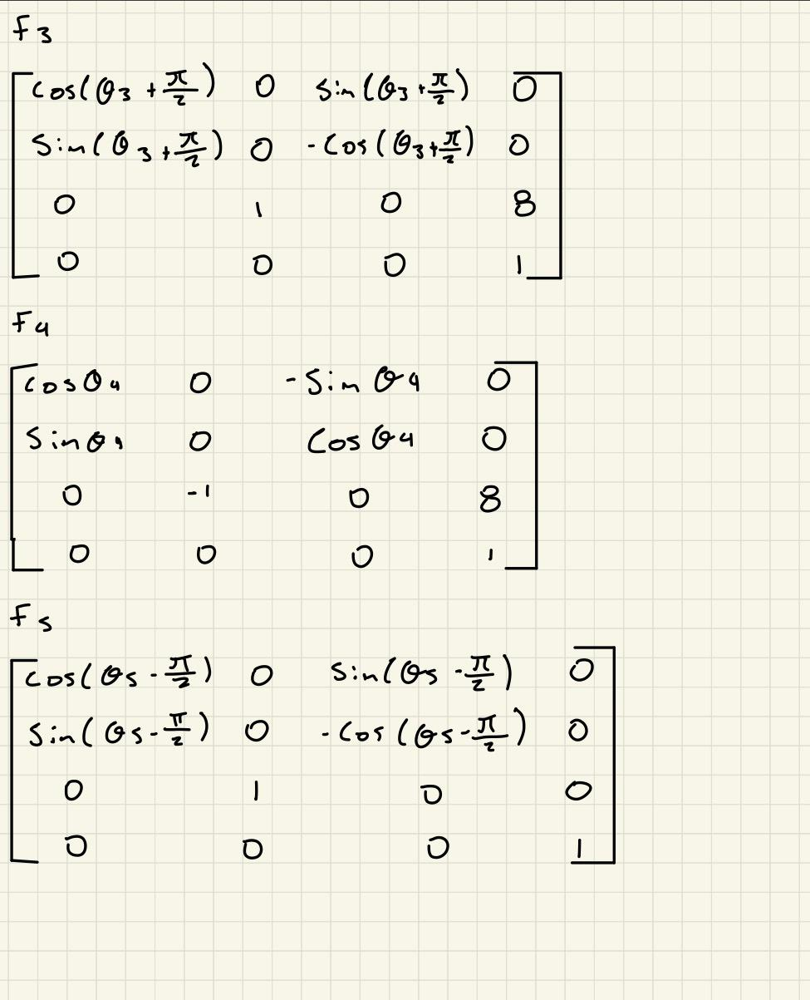
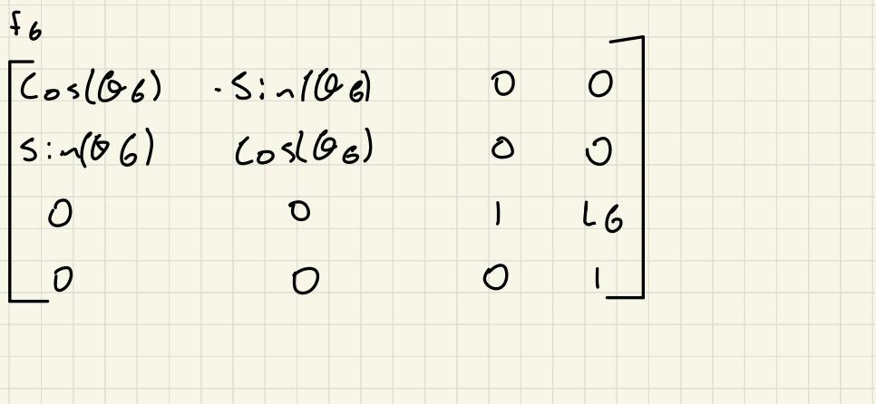

---

#  Robot 5

## Robot Photo

## Frame Assignment / Scheme
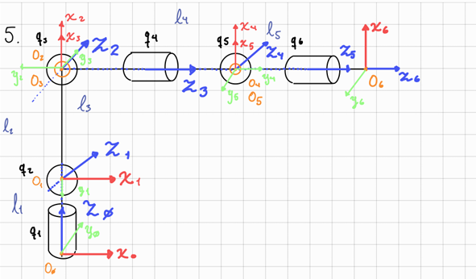

## DH Table 
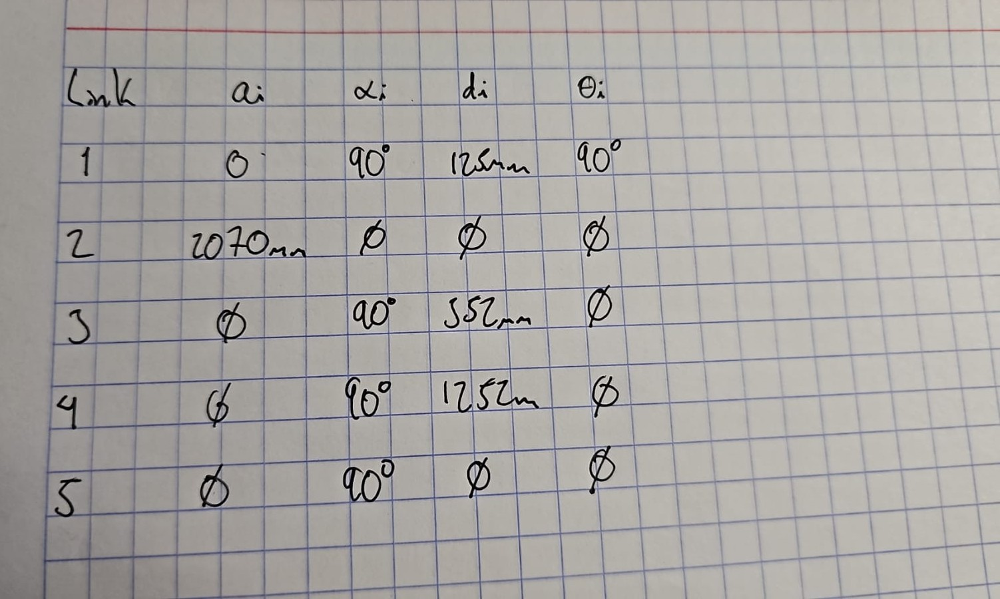

---
