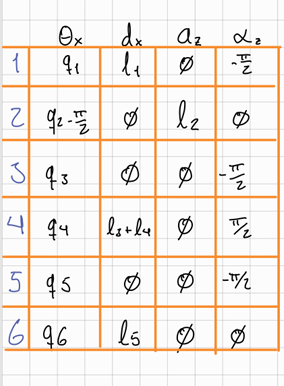
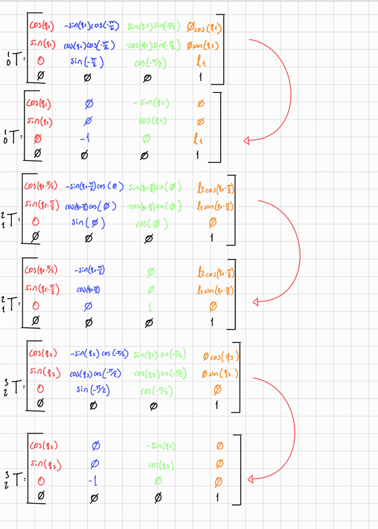

# Forward Kinematics 

This repository is used to document **Denavit–Hartenberg (DH) frame placement** and **homogeneous transformation matrices** for diferent robots.


---

#  Robot 1

## Robot Photo


## Frame Assignment / Scheme


## DH Table and matrixes 


## Matrix


---

#  Robot 2

## Robot Photo


## Frame Assignment / Scheme


## DH Table 

## Matrix

## Result


---

#  Robot 3

## Robot Photo


## Frame Assignment / Scheme


## DH Table 


## Matrix


---

#  Robot 4

## Robot Photo


## Frame Assignment / Scheme


## DH Table 


# Trigonometric Notation

cᵢ = cos(θᵢ)  
sᵢ = sin(θᵢ)  

c₂₃ = cos(θ₂ + θ₃)  
s₂₃ = sin(θ₂ + θ₃)  

c₃ = cos(θ₃ + π/2)  
s₃ = sin(θ₃ + π/2)  

c₅ = cos(θ₅ + π/2)  
s₅ = sin(θ₅ + π/2)  
---

# Transformation Matrices

## A1

```
A1 = [
 c1  0  -s1  0
 s1  0   c1  0
 0  -1   0  13
 0   0   0   1
]
```

## A2

```
A2 = [
 c2 -s2 0 8c2
 s2  c2 0 8s2
 0   0  1  0
 0   0  0  1
]
```

## A3

```
A3 = [
 -s3 0  c3 0
  c3 0  s3 0
  0  1  0 d3
  0  0  0 1
]
```

## A4

```
A4 = [
 c4  0 -s4  0
 s4  0  c4  0
 0  -1  0 -d4
 0   0  0  1
]
```

## A5

```
A5 = [
 s5 0  c5 0
 -c5 0 s5 0
 0  1  0  0
 0  0  0  1
]
```

## A6

```
A6 = [
 c6 -s6 0 0
 s6  c6 0 0
 0   0  1 d6
 0   0  0 1
]
```

---

# Final Transformation Matrix

```
T06 = [
 r11 r12 r13 px
 r21 r22 r23 py
 r31 r32 r33 pz
 0   0   0   1
]
```

---

# Rotation Terms

```
r11 = c1*c23*c4*s5 + c1*s23*c5 - s1*s4*s5

r12 = c6*(c1*c23*s4 + s1*c4)
      - s6*(c1*c23*c4*c5 - c1*s23*s5 - s1*s4*c5)

r13 = s6*(c1*c23*s4 + s1*c4)
      + c6*(c1*c23*c4*c5 - c1*s23*s5 - s1*s4*c5)

r21 = s1*c23*c4*s5 + s1*s23*c5 + c1*s4*s5

r22 = c6*(s1*c23*s4 - c1*c4)
      - s6*(s1*c23*c4*c5 - s1*s23*s5 + c1*s4*c5)

r23 = s6*(s1*c23*s4 - c1*c4)
      + c6*(s1*c23*c4*c5 - s1*s23*s5 + c1*s4*c5)

r31 = s23*c4*s5 - c23*c5

r32 = c6*s23*s4
      - s6*(s23*c4*c5 + c23*s5)

r33 = s6*s23*s4
      + c6*(s23*c4*c5 + c23*s5)
```

---

# Position Terms

```
px = c1*(8*c2 + 8*c23 - d4*s23) - d3*s1

py = s1*(8*c2 + 8*c23 - d4*s23) + d3*c1

pz = 13 + 8*s2 + 8*s23 + d4*c23 + d6
```

---


#  Robot 5

## Robot Photo


## Frame Assignment / Scheme


## DH Table 


## Matrix

## Result


---
