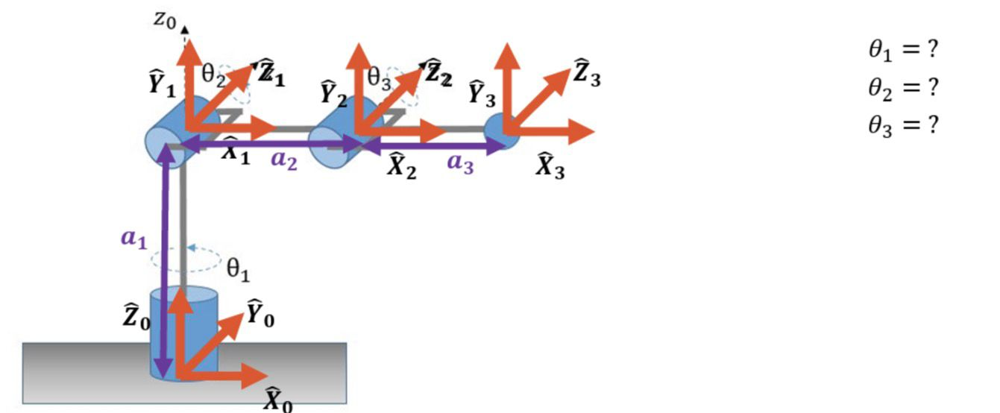
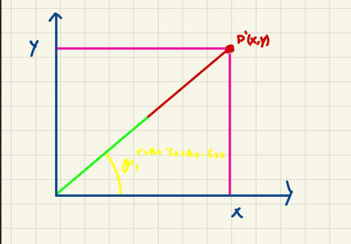
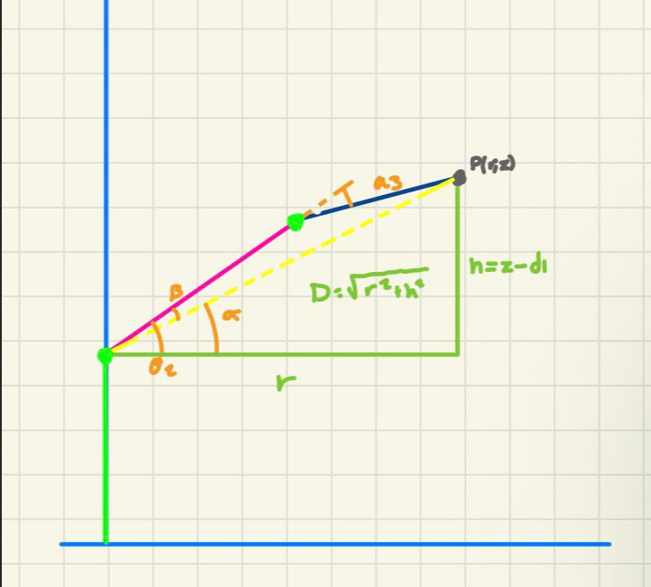

# Inverse Kinematics 

This repository documents **Inverse Kinematics** for one robot, it will explain the Geometrical method to get ecuations to late get a jacobian value

## Robot Description



The robot has 3 revolute joints:

- **Joint 1 (θ₁)** — rotates about Z₀ (vertical axis), waist
- **Joint 2 (θ₂)** — rotates about horizontal axis, shoulder
- **Joint 3 (θ₃)** — rotates about horizontal axis, elbow

| Joint | θᵢ | dᵢ | aᵢ | αᵢ |
|-------|-----|-----|-----|-----|
| 1 | θ₁ | d₁ | 0  | 90° |
| 2 | θ₂ | 0  | a₂ | 0°  |
| 3 | θ₃ | 0  | a₃ | 0°  |

> **d₁** is the vertical offset (base height). **a₂, a₃** are the horizontal link lengths.


## Inverse Kinematics — Geometric Method

Given a target point P = (x, y, z), find θ₁, θ₂, θ₃.

The problem is divided into two views:

| View       | Solves  | Why                              |
|------------|---------|----------------------------------|
| Top (XY)   | θ₁      | d₁ is vertical, vanishes in XY  |
| Side (r–z) | θ₂, θ₃  | 2R problem in the vertical plane |

### Top View

### Side View


---

### Step 1 — Solve θ₁ (Top View)

Looking down from above, d₁ disappears. The arm projects as a single ray from O to P:
```
x = r·cos(θ₁)
y = r·sin(θ₁)
```

Dividing y by x:
```
y/x = sin(θ₁)/cos(θ₁) = tan(θ₁)
```

Therefore:
```
θ₁ = atan2(y, x)
```

---

### Step 2 — Decouple into the Side View

Since θ₁ is known, collapse the 3D problem into a 2D plane using:

**Horizontal reach** — distance from the Z axis to P:
```
r = √(x² + y²)
```

> This follows from x²+y² = r²·cos²(θ₁) + r²·sin²(θ₁) = r²

**Height above J₁** — subtract the fixed base offset:
```
h = z − d₁
```

> We subtract d₁ because joints 2 and 3 act from J₁, not from the ground.

**Distance from J₁ to P:**
```
D = √(r² + h²)
```

Now θ₂ and θ₃ form a **2R robot in the (r, h) plane**.

---

### Step 3 — Solve θ₃ (Law of Cosines)

In the triangle J₁ — J₂ — P, the three sides are a₂, a₃, and D.
```
D² = a₂² + a₃² + 2·a₂·a₃·cos(θ₃)
```

Solving for cos(θ₃):
```
2·a₂·a₃·cos(θ₃) = D² − a₂² − a₃²

cos(θ₃) = (D² − a₂² − a₃²) / (2·a₂·a₃)

sin(θ₃) = ±√(1 − cos²(θ₃))

θ₃ = atan2( ±√(1 − cos²(θ₃)) , cos(θ₃) )
```

> **+** → elbow up
> **−** → elbow down

---

### Step 4 — Solve θ₂ (α − β Decomposition)

θ₂ is not simply the angle from horizontal to J₁→P. Link a₃ bends at J₂ and shifts P away from where a₂ alone would point. So we split into two angles:

**α** — angle from horizontal to the line J₁→P:
```
α = atan2(h, r)
```

**β** — how much a₃'s bend shifts the direction of J₁→P away from a₂:

```
θ₂ = α − β = atan2(h, r) − atan2(a₃·sin(θ₃), a₂ + a₃·cos(θ₃))
```

---


## Position Jacobian — Geometric Method (3×3)

Maps joint velocities to end-effector linear velocities:
```
| ẋ |        | θ̇₁ |
| ẏ |  = Jᵥ·| θ̇₂ |
| ż |        | θ̇₃ |
```

For each revolute joint the column is:
```
Jᵥᵢ = ẑᵢ₋₁ × (pₑ − pᵢ₋₁)
```

---

### Joint Axes
```
ẑ₀ = [0,    0,   1]ᵀ     
ẑ₁ = [−s₁,  c₁,  0]ᵀ      
ẑ₂ = [−s₁,  c₁,  0]ᵀ      
```

### Joint Positions
```
p₀ = [0,          0,          0          ]ᵀ
p₁ = [0,          0,          d₁         ]ᵀ
p₂ = [a₂·c₁·c₂,  a₂·s₁·c₂,  d₁+a₂·s₂  ]ᵀ
pₑ = [c₁·r,       s₁·r,       d₁+a₂·s₂+a₃·s₂₃]ᵀ
```

Where **r = a₂·cos(θ₂) + a₃·cos(θ₂+θ₃)**

---

### Column 1 — Joint 1

Cross product ẑ₀ × (pₑ − p₀):
```
[0, 0, 1] × [r·c₁,  r·s₁,  d₁+a₂·s₂+a₃·s₂₃]

= [ (0)·(d₁+a₂·s₂+a₃·s₂₃) − (1)·(r·s₁) ]
  [ (1)·(r·c₁)              − (0)·(...)   ]
  [ (0)·(r·s₁)              − (0)·(r·c₁) ]

= [ −r·s₁ ]
  [  r·c₁ ]
  [   0   ]
```

---

### Column 2 — Joint 2

Cross product ẑ₁ × (pₑ − p₁):
```
[−s₁, c₁, 0] × [r·c₁,  r·s₁,  a₂·s₂+a₃·s₂₃]

= [ (c₁)·(a₂·s₂+a₃·s₂₃) − (0)·(r·s₁)          ]
  [ (0)·(r·c₁)            − (−s₁)·(a₂·s₂+a₃·s₂₃) ]
  [ (−s₁)·(r·s₁)          − (c₁)·(r·c₁)           ]

= [  c₁·(a₂·s₂ + a₃·s₂₃)  ]
  [  s₁·(a₂·s₂ + a₃·s₂₃)  ]
  [ −r·(s₁² + c₁²)         ]

= [  c₁·(a₂·s₂ + a₃·s₂₃)  ]
  [  s₁·(a₂·s₂ + a₃·s₂₃)  ]
  [          −r             ]
```

> s₁² + c₁² = 1, so the last entry simplifies to −r

---

### Column 3 — Joint 3

Cross product ẑ₂ × (pₑ − p₂):
```
[−s₁, c₁, 0] × [a₃·c₁·c₂₃,  a₃·s₁·c₂₃,  a₃·s₂₃]

= [ (c₁)·(a₃·s₂₃)      − (0)·(a₃·s₁·c₂₃)    ]
  [ (0)·(a₃·c₁·c₂₃)    − (−s₁)·(a₃·s₂₃)     ]
  [ (−s₁)·(a₃·s₁·c₂₃)  − (c₁)·(a₃·c₁·c₂₃)  ]

= [  a₃·c₁·s₂₃                       ]
  [  a₃·s₁·s₂₃                       ]
  [ −a₃·c₂₃·(s₁² + c₁²)             ]

= [  a₃·c₁·s₂₃  ]
  [  a₃·s₁·s₂₃  ]
  [  −a₃·c₂₃    ]
```

---

### Full 3×3 Position Jacobian
```
     |   −r·s₁        c₁·(a₂·s₂ + a₃·s₂₃)     a₃·c₁·s₂₃  |
Jᵥ = |    r·c₁        s₁·(a₂·s₂ + a₃·s₂₃)     a₃·s₁·s₂₃  |
     |     0                  −r                 −a₃·c₂₃   |
```

Where:
```
r   = a₂·cos(θ₂) + a₃·cos(θ₂+θ₃)
s₂₃ = sin(θ₂+θ₃)
c₂₃ = cos(θ₂+θ₃)
```
---

