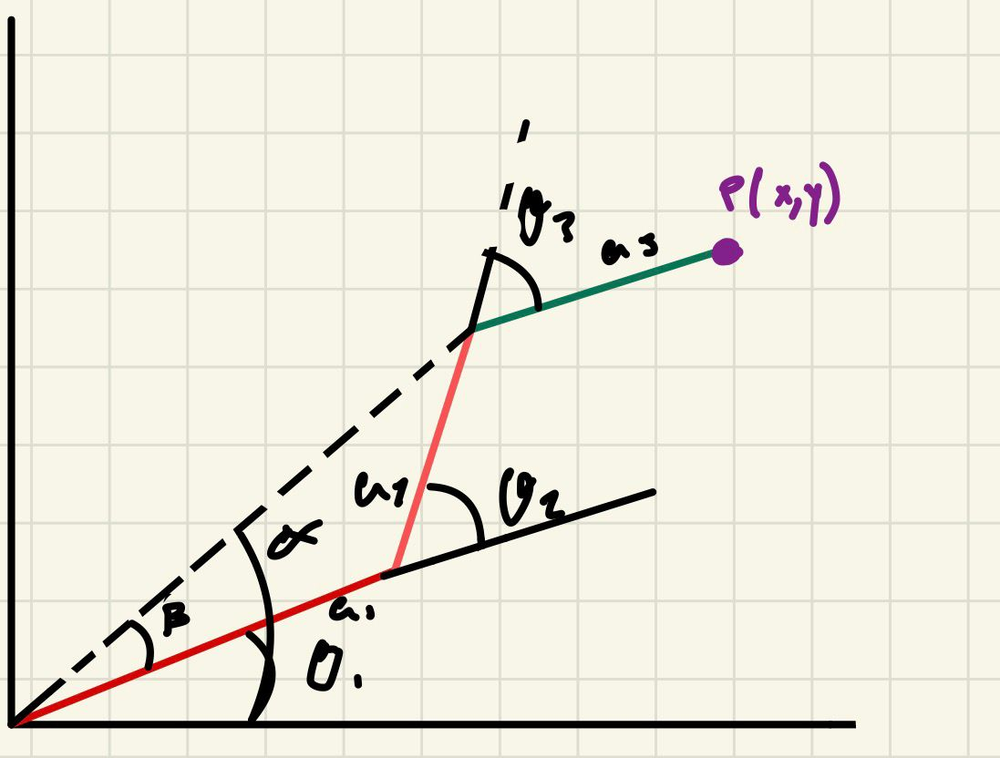

# IK

This repository documents **Inverse Kinematics**  for one robot, it will explain the Geometrical method to get ecuations to late get a jacobian value.

---
---
## robot 

 ---


## Forward Kinematics

### DH Parameters

| Joint | θᵢ | dᵢ | aᵢ | αᵢ |
|-------|-----|-----|-----|-----|
| 1 | θ₁ | 0 | a₁ | 0° |
| 2 | θ₂ | 0 | a₂ | 0° |
| 3 | θ₃ | 0 | a₃ | 0° |

All joints rotate about Z (pointing up). All links lie in the XY plane.

---


## Inverse Kinematics — Geometric Method

### Top View Analisis



### Step 1 — Wrist Decoupling

Subtract link a₃ using the known orientation φ to find the wrist point W:
```
Wₓ = x - a₃·cos(φ)
Wᵧ = y - a₃·sin(φ)
D  = √( (x - a₃·cos(φ))² + (y - a₃·sin(φ))² )
```

---

### Step 2 — Solve θ₂

Apply the **law of cosines** to triangle O–J₁–W:
```
cos(θ₂) = ( D² - a₁² - a₂² ) / ( 2·a₁·a₂ )
sin(θ₂) = ± √( 1 - cos²(θ₂) )

θ₂ = atan2( ±√(1 - cos²(θ₂)) , cos(θ₂) )
```

> **+** → elbow left solution  
> **−** → elbow right solution

---

### Step 3 — Solve θ₁

Define two auxiliary angles:
```
α = atan2( Wᵧ , Wₓ )
  = atan2( y - a₃·sin(φ) , x - a₃·cos(φ) )

β = atan2( a₂·sin(θ₂) , a₁ + a₂·cos(θ₂) )

θ₁ = α - β
```

---

### Step 4 — Solve θ₃

From the orientation constraint φ = θ₁ + θ₂ + θ₃:
```
θ₃ = φ - θ₁ - θ₂
```

---

## Jacobian — Geometric Method

For each revolute joint rotating about ẑ = [0, 0, 1]ᵀ:
```
Jᵢ = [ -(yₑ - yᵢ₋₁) ]
     [  (xₑ - xᵢ₋₁) ]
     [       1       ]
```

### Column 1 — Joint 1, from p₀ = (0, 0)
```
J₁ = [ -(a₁·s₁ + a₂·s₁₂ + a₃·s₁₂₃) ]
     [   a₁·c₁ + a₂·c₁₂ + a₃·c₁₂₃  ]
     [             1                  ]
```

### Column 2 — Joint 2, from p₁ = (a₁·c₁, a₁·s₁)
```
J₂ = [ -(a₂·s₁₂ + a₃·s₁₂₃) ]
     [   a₂·c₁₂ + a₃·c₁₂₃  ]
     [           1           ]
```

### Column 3 — Joint 3, from p₂ = (a₁·c₁ + a₂·c₁₂, a₁·s₁ + a₂·s₁₂)
```
J₃ = [ -a₃·s₁₂₃ ]
     [  a₃·c₁₂₃ ]
     [     1     ]
```

### Full Symbolic Jacobian
```
     | -(a₁s₁+a₂s₁₂+a₃s₁₂₃)   -(a₂s₁₂+a₃s₁₂₃)   -a₃s₁₂₃ |
J =  |  a₁c₁+a₂c₁₂+a₃c₁₂₃     a₂c₁₂+a₃c₁₂₃      a₃c₁₂₃  |
     |         1                      1                1     |
```

> **Rows 1–2** → linear velocity (ẋ, ẏ)  
> **Row 3**   → angular velocity φ̇ (always 1 for planar revolute joints)

---

## Determinant & Singularities
```
det(J) = a₁·a₂·sin(θ₂) + a₁·a₃·sin(θ₂+θ₃) + a₂·a₃·sin(θ₃) = 0
```

| Condition | Configuration |
|-----------|--------------|
| θ₂ = 0° or 180° | Links a₁ and a₂ fully aligned |
| θ₃ = 0° or 180° | Links a₂ and a₃ fully aligned |
| All three links collinear | Complete arm stretch or fold |