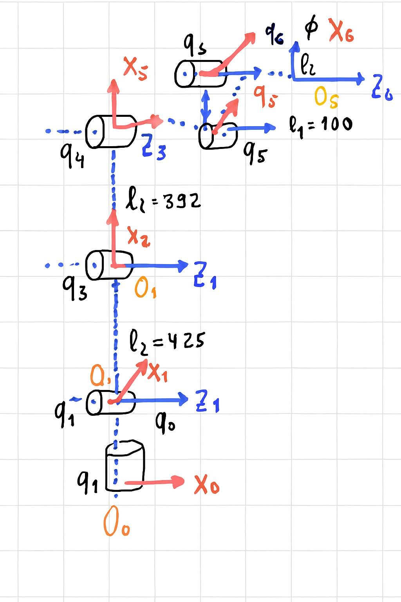

# Forward Kinematics 

This repository is used to document **Denavit–Hartenberg (DH) frame placement** for the KUKA KG6 & UR robots 

---

#  KUKA

## Robot Photo

## Frame Assignment / Scheme

## DH Table 
| Joint | d    | θ   | a    | α    |
|-------|------|-----|------|------|
| 1     | -435 | θ₁  | 260  | π/2  |
| 2     | 0    | θ₂  | -680 | 0    |
| 3     | 0    | θ₃  | 0    | -π/2 |
| 4     | -630 | θ₄  | 0    | π/2  |
| 5     | 0    | θ₅  | 0    | -π/2 |
| 6     | -135 | θ₆  | 0    | 0    |

---

#  UR

## Robot Photo

## Frame Assignment / Scheme

## DH Table 
| Joint | d   | θ           | a   | α    |
|-------|-----|-------------|-----|------|
| 1     | 162 | q₂ + π/2    | ∅   | π/2  |
| 2     | ∅   | q₂ + π/2    | 425 | ∅    |
| 3     | ∅   | q₃          | 392 | ∅    |
| 4     | 133 | q₄ - π/2    | ∅   | -π/2 |
| 5     | 100 | q₅          | ∅   | π/2  |
| 6     | 42  | q₆ + π/2    | ∅   | ∅    |

---

