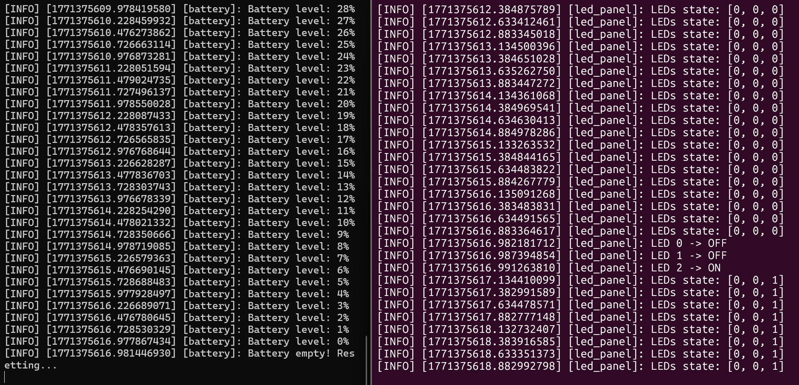
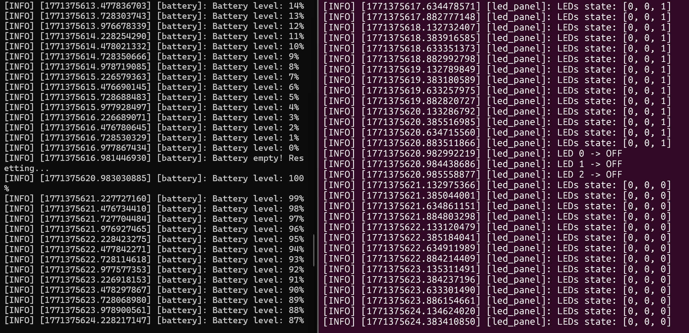

# Battery and LED Panel Service Project

## Description

This project demonstrates a ROS 2 service–client architecture combined with a publisher–subscriber pattern.  
A **Battery node** simulates battery discharge and communicates with a **LED Panel node** through a service interface to control LEDs. The LED Panel publishes its state continuously, while the Battery requests LED changes when the battery reaches certain conditions.

---

## Nodes Overview

- **Battery**  
  - Simulates battery discharge from 100% down to 0%  
  - Calls the `set_led` service to control LED states  
  - Resets battery level after reaching 0%  

- **LED Panel**  
  - Provides the `set_led` service to update LED states  
  - Publishes LED states on the `led_panel_state` topic  
  - Maintains internal LED array `[0,0,0]`  

---

## Source Codes

### battery.py

```python
#!/usr/bin/env python3

import rclpy
from rclpy.node import Node
from brian_interfaces.srv import Ledset
from time import sleep

class Battery(Node):

    def __init__(self):
        super().__init__("battery")

        self.client = self.create_client(Ledset, "set_led")
        while not self.client.wait_for_service(timeout_sec=1.0):
            self.get_logger().info("Waiting for set_led service...")

        self.battery_level = 100
        self.timer = self.create_timer(0.25, self.update_battery)

        self.get_logger().info("Battery node started at 100%")

    def update_battery(self):
        self.get_logger().info(f"Battery level: {self.battery_level}%")

        if self.battery_level == 0:
            self.set_leds([0, 0, 1])
            self.get_logger().info("Battery empty! Resetting...")
            sleep(4)
            self.set_leds([0, 0, 0])
            self.battery_level = 101  

        self.battery_level -= 1

    def set_leds(self, states):
        for i, state in enumerate(states):
            request = Ledset.Request()
            request.led_index = i
            request.state = bool(state)
            self.client.call_async(request)

def main(args=None):
    rclpy.init(args=args)
    node = Battery()
    rclpy.spin(node)
    rclpy.shutdown()

if __name__ == "__main__":
    main()
```
    
### led_panel.py
```python
#!/usr/bin/env python3

import rclpy
from rclpy.node import Node
from brian_interfaces.msg import Led
from brian_interfaces.srv import Ledset

class LedPanel(Node):

    def __init__(self):
        super().__init__("led_panel")

        self.leds = [0, 0, 0]
        self.publisher = self.create_publisher(Led, "led_panel_state", 10)
        self.service = self.create_service(Ledset, "set_led", self.set_led_callback)
        self.timer = self.create_timer(0.25, self.publish_state)

        self.get_logger().info("LED Panel Ready")

    def publish_state(self):
        msg = Led()
        msg.leds = self.leds
        self.publisher.publish(msg)
        self.get_logger().info(f"LEDs state: {self.leds}")

    def set_led_callback(self, request, response):
        index = request.led_index
        state = request.state

        if 0 <= index < len(self.leds):
            self.leds[index] = 1 if state else 0
            response.success = True
            self.get_logger().info(f"LED {index} -> {'ON' if state else 'OFF'}")
        else:
            response.success = False

        return response

def main(args=None):
    rclpy.init(args=args)
    node = LedPanel()
    rclpy.spin(node)
    rclpy.shutdown()

if __name__ == "__main__":
    main()
```
---
## Custom Interfaces

### Led.msg

```text
int32[] leds
```
### Ledset.srv
```text
int32 led_index
bool state
---
bool success
```
---
## Execution

```bash
ros2 run brians_pkg battery
ros2 run brians_pkg led_panel
rqt_graph

```
---

## Terminal Output

in this photo you can see the battery node and the led panel node when the battery gets to 0 it turns on the led light in the third position 
 


in this photo you can see the battery node and the led panel node when the battery is recharged it resets the led lights 


in these photos you can see the eco and the equivalent reaccion in the third terminal


## Results


---