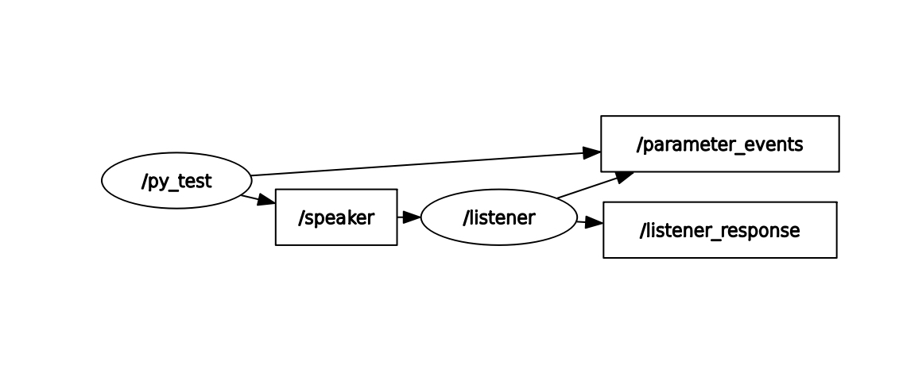

# Reset Counter Service Project

## Description

This project demonstrates a ROS 2 publisher–subscriber architecture with an
additional service interface. A publisher sends string messages periodically
on a topic, while a listener node receives them, counts each message, publishes
a response, and provides a service to reset the counter.

---

## Nodes Overview

- **publisher**  
  Publishes string messages to the `speaker` topic.

- **listener**  
  - Subscribes to the `speaker` topic  
  - Counts the received messages  
  - Publishes responses on `listener_response`  
  - Provides a service `reset_listener` to reset the counter  

---

## Source Code

### listener.py

```python
import rclpy
from rclpy.node import Node
from example_interfaces.msg import String
from example_interfaces.srv import SetBool


class Listener(Node):
    def __init__(self):
        super().__init__("listener")
        self.counter = 0
        self.create_subscription(
            String,
            "speaker",
            self.callback,
            10
        )

        self.publisher_ = self.create_publisher(
            String,
            "listener_response",
            10
        )
        self.create_service(
            SetBool,
            "reset_listener",
            self.handle_service
        )

        self.get_logger().info("Listener with reset service ready")

    def callback(self, msg):
        self.counter += 1

        self.get_logger().info(
            f"Message #{self.counter}: {msg.data}"
        )

        response = String()
        response.data = f"Received {self.counter} messages"
        self.publisher_.publish(response)

    def handle_service(self, request, response):
      
        if request.data:
            self.counter = 0
            response.message = "Counter reset to 0"
        else:
            response.message = "Counter continues without reset"

        response.success = True
        return response


def main():
    rclpy.init()
    node = Listener()
    rclpy.spin(node)
    rclpy.shutdown()


if __name__ == "__main__":
    main()
```

---

## Execution

```bash
ros2 run brians_pkg r2d2
ros2 run brians_pkg listener
ros2 service call /reset_listener example_interfaces/srv/SetBool "{data: true}"
ros2 service call /reset_listener example_interfaces/srv/SetBool "{data: false}"
rqt_graph

```

---

## Terminal Output


## Results

Here is a screenshot of the terminal output showing the publisher and listener in action:

---